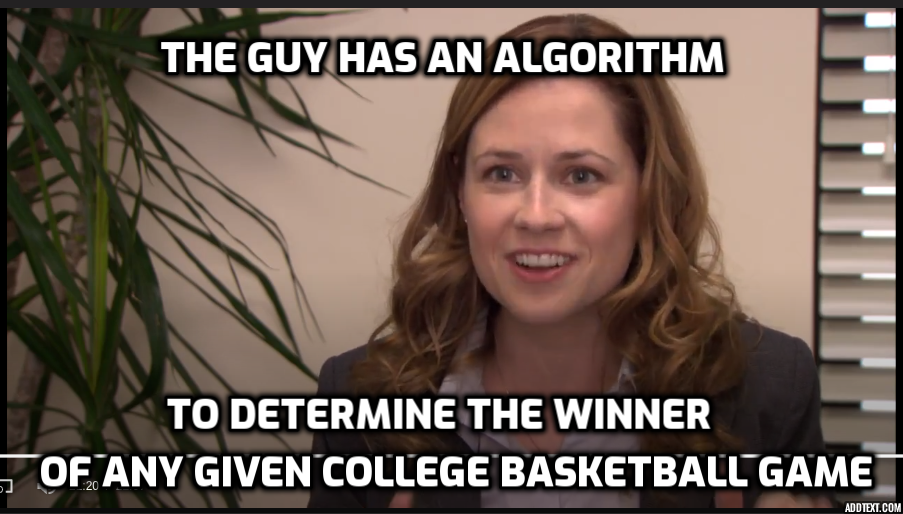

# Dillon Koch

    

<!-- ## [LinkedIn](https://www.linkedin.com/in/dillon-koch/) -->

<!-- TODO insert new resume -->
<!-- ## [Resume](/Dillon_Koch_Resume.pdf)  -->

### Projects
- [Sports Betting](https://github.com/DillonKoch/Sports_Betting) - predicting Spread, Moneyline, and Total bets likely to win in the NFL, NBA, NCAA Football, and NCAA Basketball
- [Ping Pong Shot Charts and Training Games](https://github.com/DillonKoch/Ping-Pong) - an AI ping pong referee that locates the table, ball, and detects events (hits, bounces, net hits)
- [Popquiznotes](https://github.com/DillonKoch/popquiznotesv2) - a notetaking app where users write questions and notes concurrently, then receive a pop quiz on their notes
